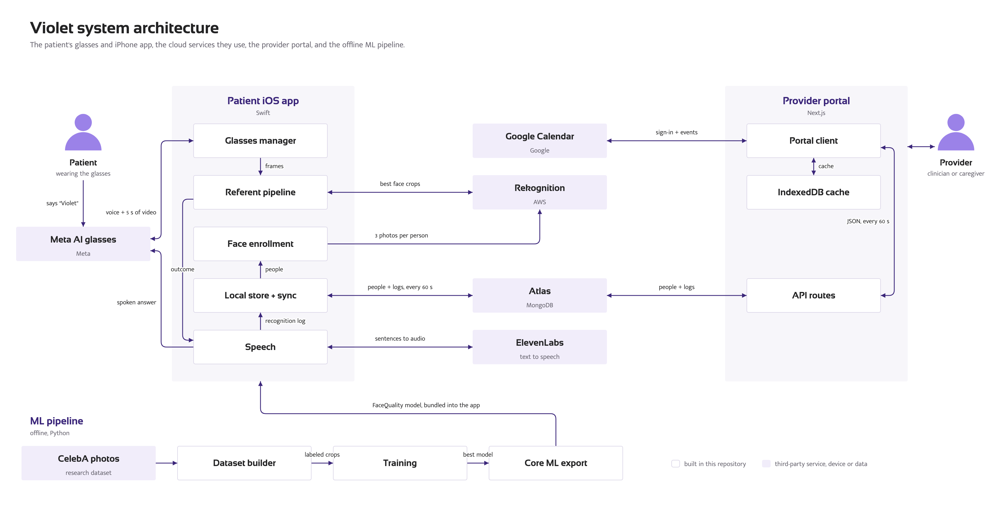
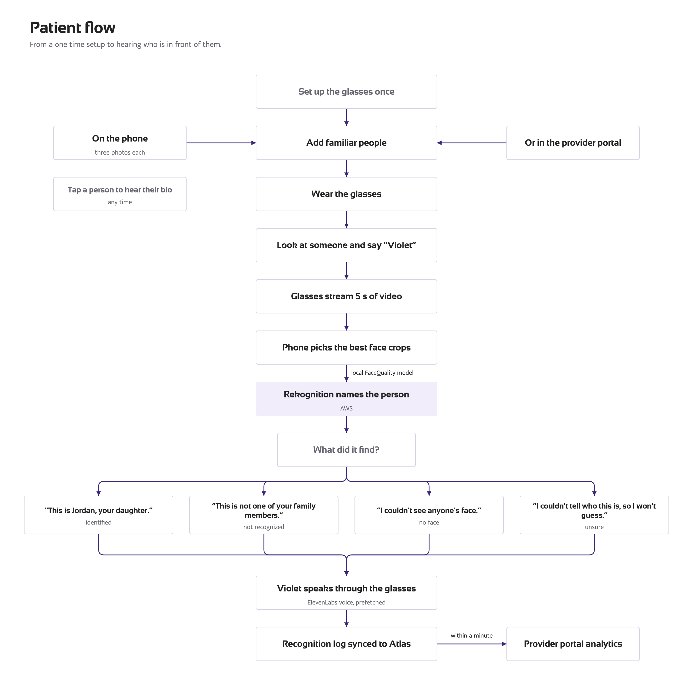
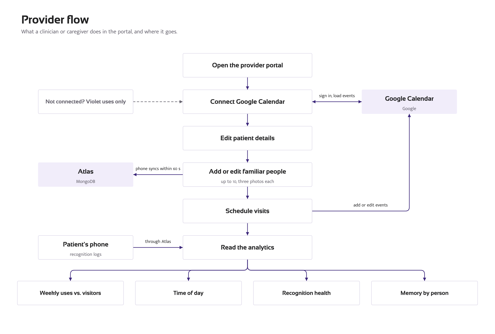

  

# Violet

Violet is an ML-powered memory assistant that helps people with dementia stay connected with loved ones using Meta AI glasses, face-quality scoring, memory cues, and symptom logging.

## Motivation

Memory loss can make everyday interactions with loved ones painful and isolating. Violet is designed to support—not replace—the work of remembering: it offers gentle context cues such as a person's relationship, shared experiences, and recent events so the wearer can reason through the memory themselves. With the wearer's consent, a caregiver portal also turns Violet usage into longitudinal trends that can help families and clinicians understand when more support may be needed.

Read the full story on [Devpost](https://devpost.com/software/violet-2gbnrc) or [watch the demo](https://www.youtube.com/watch?v=Rnn226TZ5CY).

## How it works

1. A caregiver enrolls familiar people—with their consent—using reference photos and relationship context.
2. The wearer invokes Violet by voice or with the glasses button. The glasses stream up to five seconds of video to the iPhone.
3. Apple Vision and an on-device Core ML model select the best face crop, AWS Rekognition matches it, and ElevenLabs speaks a concise memory cue through the active audio output.
4. MongoDB Atlas syncs relationships and recognition logs with a Next.js provider portal, where Google Calendar context and usage trends help caregivers interpret the data.

## Demo diagrams

### System architecture

### Patient flow

### Provider flow

The diagrams are generated from code; see [`demo/README.md`](demo/README.md) for regeneration instructions.

## Explore the project

| Component | Description |
|---|---|
| [`iOS/`](iOS/) | SwiftUI patient app, Meta Wearables integration, on-device face processing, recognition, and voice output |
| [`webapp/`](webapp/) | Next.js caregiver and clinician portal |
| [`ml/facequality/`](ml/facequality/) | Dataset, training, evaluation, and export pipeline for the face-quality model |
| [`demo/`](demo/) | Architecture and user-flow diagrams plus synthetic demo-data tooling |

Setup instructions live in the [iOS README](iOS/README.md) and [provider portal README](webapp/README.md).
